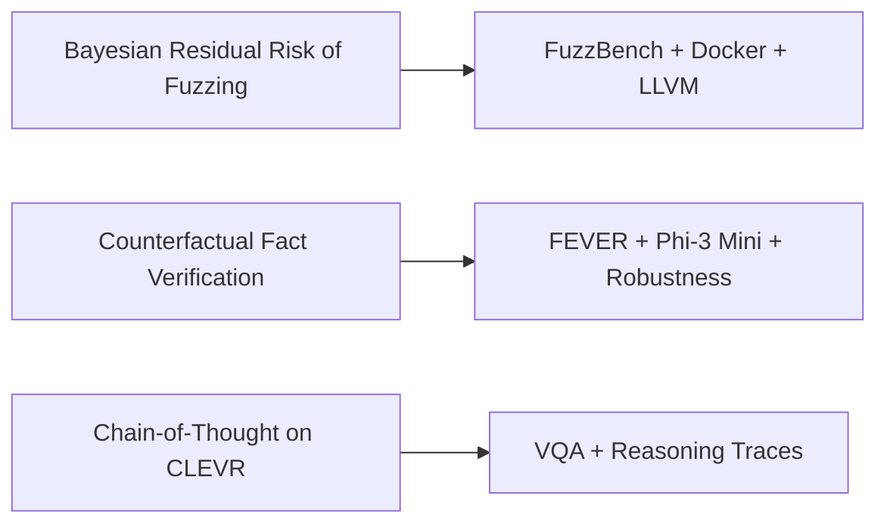

<div align="center">

<!-- Animated intro -->


<br />

<a href="https://www.srivatsakamballa.site">
  
</a>
<a href="https://www.linkedin.com/in/srivatsa-kamballa">
  
</a>
<a href="mailto:srivatsakamballa02@gmail.com">
  
</a>
<a href="https://github.com/Srivatsa03?tab=repositories">
  
</a>

<br />
<br />


</div>

---

## What I Am Good At

I build **cloud-ready systems, DevOps pipelines, AI platforms, and research infrastructure**. My work usually sits where software engineering meets automation, data, and production-style thinking.

```text
Cloud / DevOps        -> Docker, Kubernetes, Terraform, CI/CD, monitoring, automation
AI Platforms          -> RAG, Graph-RAG, LLM agents, vector search, evaluation pipelines
Research Systems      -> fuzzing, Bayesian risk estimation, reproducible experiments
Backend / Data        -> Python, SQL, APIs, ETL, validation, dashboards, workflow state
```

---

## Current Signal

<table>
  <tr>
    <td width="50%">
      <h3>Cloud + DevOps</h3>
      <p>Building repeatable infrastructure, deployment workflows, testing pipelines, observability, and automation-heavy systems.</p>
    </td>
    <td width="50%">
      <h3>AI Platform Engineering</h3>
      <p>Building RAG systems, metadata pipelines, vector retrieval, LLM evaluation, and evidence-backed AI workflows.</p>
    </td>
  </tr>
  <tr>
    <td width="50%">
      <h3>Research Infrastructure</h3>
      <p>Designing reproducible experiments for fuzzing, software testing, Bayesian risk estimation, and local LLM robustness.</p>
    </td>
    <td width="50%">
      <h3>Production Mindset</h3>
      <p>APIs, persistent logs, workflow state, source-grounded outputs, dashboards, validation checks, and measurable reliability.</p>
    </td>
  </tr>
</table>

---

## Featured Engineering Work

<div align="center">

<a href="https://github.com/Srivatsa03/ECI-Pipeline">
  
</a>
<a href="https://github.com/Srivatsa03/fuzzbench">
  
</a>

<a href="https://github.com/Srivatsa03/UICLaborDocsChatbot">
  
</a>
<a href="https://github.com/Srivatsa03/Movie-Recommendation">
  
</a>

</div>

---

## Project Map

| Area | Project | Why it matters |
|---|---|---|
| Risk Intelligence | [ECI Pipeline](https://github.com/Srivatsa03/ECI-Pipeline) | DeltaRAG + Graph-RAG pipeline that turns Android ecosystem changes into evidence-backed risk tickets |
| Software Testing | [FuzzBench Research Pipeline](https://github.com/Srivatsa03/fuzzbench) | Reproducible fuzzing infrastructure with Bayesian residual-risk estimation |
| AI Platform | [MetARAG](https://github.com/Srivatsa03/UICLaborDocsChatbot) | RAG chatbot for large PDF collections with metadata enrichment and source-grounded retrieval |
| MLOps | [Movie Recommendation](https://github.com/Srivatsa03/Movie-Recommendation) | Model training, API serving, Docker, CI/CD, Prometheus, Grafana, drift checks, A/B testing |
| Security | [MTProto 2.0](https://github.com/Srivatsa03/Telegram-MTproto2.0) | End-to-end encrypted messaging protocol implementation |
| Reasoning | [Chain-of-Thought on CLEVR](https://github.com/Srivatsa03/Chain-of-Thought-on-CLEVR-) | Evaluating supervised reasoning traces for visual question answering |

---

## Active Work



- **A Bayesian Approach to Estimating Residual Risk of Fuzzing**  
  Building statistical estimators and reproducible fuzzing workflows for measuring residual software risk.

- **Counterfactual Fact Verification**  
  Evaluating local LLM robustness on FEVER using structurally tiered claims and counterfactual variants.

- **Chain-of-Thought on CLEVR**  
  Studying how supervised reasoning traces affect visual question answering behavior.

---

## Tech Stack

<div align="center">

### Cloud / DevOps


### AI / Data / Backend


</div>

---

## Experience Snapshot

| Role | Organization | Focus |
|---|---|---|
| Graduate Research Assistant - DevOps Engineer | University of Illinois Chicago | Docker, FuzzBench, LLVM, reproducible testing pipelines |
| Graduate Research Assistant - AI Platform Engineer | University of Illinois Chicago | RAG, LLM evaluation, document intelligence, metadata pipelines |
| Trainee Software Engineer | Mu Sigma | Python, SQL, ETL automation, data quality, analytics workflows |

---

## GitHub Trophies

<div align="center">
  
</div>

---

## GitHub Metrics

<div align="center">
  
  
</div>

<div align="center">
  
</div>

<div align="center">
  
</div>

---

## Contribution Snake

<div align="center">
  <picture>
    <source media="(prefers-color-scheme: dark)" srcset="https://raw.githubusercontent.com/Srivatsa03/Srivatsa03/output/github-snake-dark.svg" />
    <source media="(prefers-color-scheme: light)" srcset="https://raw.githubusercontent.com/Srivatsa03/Srivatsa03/output/github-snake.svg" />
    
  </picture>
</div>

---

## Contact

<div align="center">

I am open to roles and conversations around **DevOps, Cloud Engineering, Platform Engineering, AI Infrastructure, Backend Engineering, and Applied AI systems**.

<br />

<a href="https://www.srivatsakamballa.site">
  
</a>
<a href="https://www.linkedin.com/in/srivatsa-kamballa">
  
</a>
<a href="mailto:srivatsakamballa02@gmail.com">
  
</a>

</div>
