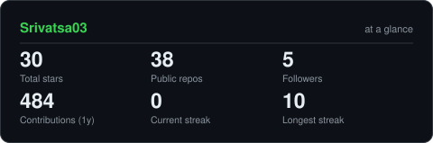
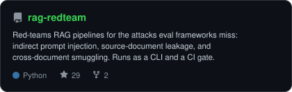
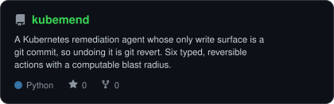
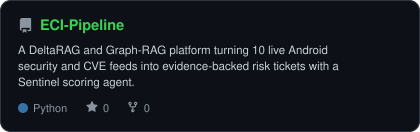
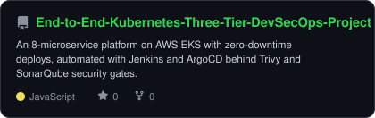

<div align="center">

<!-- PORTRAIT - colored dot-matrix cutout, subject only on a transparent ground.
     Regenerate with:
       rembg i assets/profile.jpg assets/profile-cutout.png
       python scripts/dotify.py assets/profile-cutout.png -o assets/portrait --cols 100 --equalize --detail 0.5 --color -->


<br>

<!-- NAME / TAGLINE - animated typing -->
<a href="https://github.com/Srivatsa03">
  
</a>

<br>

<!-- SOCIALS -->
<a href="https://linkedin.com/in/srivatsa-kamballa"></a>
<a href="mailto:srivatsakamballa02@gmail.com"></a>
<a href="https://srivatsa-kamballa.vercel.app"></a>
<a href="https://github.com/Srivatsa03"></a>


</div>

---

## `~/` whoami

```console
$ cat about.txt
```

Hi, I'm **Srivatsa Kamballa**. I build the unglamorous half of software: the pipelines, the infrastructure, and the AI systems that have to keep working after the demo crowd goes home. Most of what I do lives in the gap between "it runs on my machine" and "it survives production at 3am."

- Currently building **[kubemend](https://github.com/Srivatsa03/kubemend)** and **[rag-redteam](https://github.com/Srivatsa03/rag-redteam)**
- Portfolio: **[srivatsa-kamballa.vercel.app](https://srivatsa-kamballa.vercel.app)**
- MS Computer Science **@ University of Illinois Chicago** (GPA 3.88)
- Open to full-time **Software**, **Platform / Infrastructure**, and **AI Engineering** roles across the US
- Fun fact: **I fix the bugs everyone else scrolled past** in libraries you already import (7 merged PRs across Pydantic, LiteLLM, LlamaIndex, Haystack)

<br>

<div align="center">

## `~/` toolbox


</div>

---

<div align="center">

## `~/` skill radar

<table>
<tr>
<td width="50%" align="center" valign="middle">

<!-- Self-rated radar - edit assets/skills.json, scripts/radar.py redraws it -->
<picture>
  <source media="(prefers-color-scheme: dark)"  srcset="assets/radar-dark.svg">
  <source media="(prefers-color-scheme: light)" srcset="assets/radar-light.svg">
  
</picture>

</td>
<td width="50%" align="center" valign="middle">

<!-- Live radar from real language byte counts across the public repos -->
<picture>
  <source media="(prefers-color-scheme: dark)"  srcset="assets/radar-langs-dark.svg">
  <source media="(prefers-color-scheme: light)" srcset="assets/radar-langs-light.svg">
  
</picture>

</td>
</tr>
</table>

</div>

---

<div align="center">

## `~/` contribution calendar

<!-- 3D isometric calendar, generated by scripts/isocal.py from live contribution data -->
<picture>
  <source media="(prefers-color-scheme: dark)"  srcset="assets/isocal-dark.svg">
  <source media="(prefers-color-scheme: light)" srcset="assets/isocal-light.svg">
  
</picture>

<br><br>

<!-- Snake eats the contribution graph - produced on the output branch by snake.yml -->


</div>

---

<div align="center">

## `~/` the numbers

<!-- Self-drawn cards by scripts/cards.py: never depend on a shared public instance -->
<picture>
  <source media="(prefers-color-scheme: dark)"  srcset="assets/card-stats-dark.svg">
  <source media="(prefers-color-scheme: light)" srcset="assets/card-stats-light.svg">
  
</picture>

<br><br>


</div>

---

<div align="center">

## `~/` selected work

<table>
<tr>
<td>
  <a href="https://github.com/Srivatsa03/rag-redteam">
    <picture>
      <source media="(prefers-color-scheme: dark)"  srcset="assets/card-rag-redteam-dark.svg">
      <source media="(prefers-color-scheme: light)" srcset="assets/card-rag-redteam-light.svg">
      
    </picture>
  </a>
</td>
<td>
  <a href="https://github.com/Srivatsa03/kubemend">
    <picture>
      <source media="(prefers-color-scheme: dark)"  srcset="assets/card-kubemend-dark.svg">
      <source media="(prefers-color-scheme: light)" srcset="assets/card-kubemend-light.svg">
      
    </picture>
  </a>
</td>
</tr>
<tr>
<td>
  <a href="https://github.com/Srivatsa03/ECI-Pipeline">
    <picture>
      <source media="(prefers-color-scheme: dark)"  srcset="assets/card-ECI-Pipeline-dark.svg">
      <source media="(prefers-color-scheme: light)" srcset="assets/card-ECI-Pipeline-light.svg">
      
    </picture>
  </a>
</td>
<td>
  <a href="https://github.com/Srivatsa03/End-to-End-Kubernetes-Three-Tier-DevSecOps-Project">
    <picture>
      <source media="(prefers-color-scheme: dark)"  srcset="assets/card-End-to-End-Kubernetes-Three-Tier-DevSecOps-Project-dark.svg">
      <source media="(prefers-color-scheme: light)" srcset="assets/card-End-to-End-Kubernetes-Three-Tier-DevSecOps-Project-light.svg">
      
    </picture>
  </a>
</td>
</tr>
</table>

<sub>

| project | what it is | stack |
|---|---|---|
| **[rag-redteam](https://github.com/Srivatsa03/rag-redteam)** | red-teams RAG pipelines for injection, leakage, and smuggling; CLI + CI gate | `Python` `LLM Security` `PyPI` |
| **[kubemend](https://github.com/Srivatsa03/kubemend)** | Kubernetes remediation agent whose only write surface is a git commit | `Python` `Kubernetes` `GitOps` |
| **[ECI Pipeline](https://github.com/Srivatsa03/ECI-Pipeline)** | DeltaRAG + Graph-RAG turning 10 live CVE feeds into evidence-backed risk tickets | `FastAPI` `pgvector` `AWS` |
| **[DevSecOps on EKS](https://github.com/Srivatsa03/End-to-End-Kubernetes-Three-Tier-DevSecOps-Project)** | 8-microservice platform, Jenkins + ArgoCD, Trivy/SonarQube gates | `AWS EKS` `Terraform` `ArgoCD` |

</sub>

</div>

---

## `~/` open source

Those repos that look like forks of **Pydantic**, **LiteLLM**, **LlamaIndex**, and **Haystack**? That's where I actually fixed things. I like finding the bug everyone else scrolled past.

- **[Pydantic](https://github.com/pydantic/pydantic/pull/13374)** (28k star): a `json_schema_extra` dict was silently dropped, and schema generation could crash, when a callable followed it in an `Annotated` type. *PR #13374, merged.*
- **[LiteLLM](https://github.com/BerriAI/litellm/pull/30764)** (53k star): a masker leaked short secrets (8 chars or fewer) straight into logs and the admin UI. *PR #30764, merged.*
- **[LlamaIndex](https://github.com/run-llama/llama_index/pull/22133)** (51k star): silent data loss where all but the last chunk of a document was dropped on upsert. *PR #22133, merged.*
- **[LiteLLM](https://github.com/BerriAI/litellm/pull/29693)** (53k star): a 10x embedding-pricing error that was inflating everyone's cost reports. *PR #29693, merged.*
- **[Haystack](https://github.com/deepset-ai/haystack/pull/11670)** (26k star): silenced noisy ERROR logs that fired on empty inputs. *PR #11670, merged.*

---

<div align="center">

## `~/` one patent, for the curious

<sub>**Book Issue Management System for Libraries** (IP India, granted Nov 2023, co-invented): AI cameras, RFID, and automated access control for hands-off library check-in and return.</sub>

<br><br>

<sub>`$ logout` &nbsp;&middot;&nbsp; built to survive 3am &nbsp;&middot;&nbsp; thanks for scrolling</sub>

</div>
