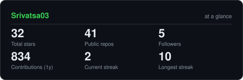
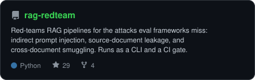
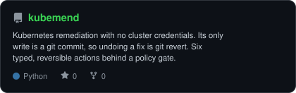
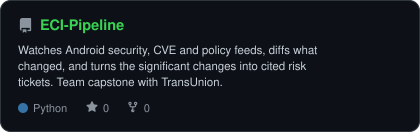
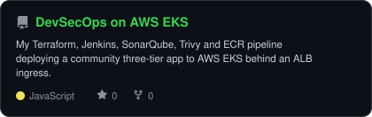

<div align="center">

<!-- PORTRAIT - colored dot-matrix cutout, subject only, reveals top-to-bottom on load.
     Regenerate:
       rembg i assets/profile.jpg assets/profile-cutout.png
       python scripts/dotify.py assets/profile-cutout.png -o assets/portrait --cols 110 --equalize --detail 0.6 --color --reveal -->


<br>

<!-- NAME / TAGLINE - animated typing -->
<a href="https://github.com/Srivatsa03">
  
</a>

<br>

<!-- SOCIALS -->
<a href="https://linkedin.com/in/srivatsa-kamballa"></a>
<a href="mailto:srivatsakamballa02@gmail.com"></a>
<a href="https://srivatsa-kamballa.vercel.app"></a>
<a href="https://github.com/Srivatsa03"></a>

</div>

---

## `~/` whoami

```console
$ cat about.txt
```

Hi, I'm **Srivatsa Kamballa**. I build the unglamorous half of software: the pipelines, the infrastructure, and the AI systems that have to keep working after the demo crowd goes home. Most of what I do lives in the gap between "it runs on my machine" and "it survives production at 3am."

- Currently building **[rag-redteam](https://github.com/Srivatsa03/rag-redteam)**, **[kubemend](https://github.com/Srivatsa03/kubemend)**, and **[minja-repro](https://github.com/Srivatsa03/minja-repro)** (reimplementing a no-code LLM-agent attack paper)
- Portfolio: **[srivatsa-kamballa.vercel.app](https://srivatsa-kamballa.vercel.app)**
- MS Computer Science **@ University of Illinois Chicago** (GPA 3.88)
- Open to full-time **Software**, **Platform / Infrastructure**, and **AI Engineering** roles across the US
- Fun fact: **I fix the bugs everyone else scrolled past** in libraries you already import (10 merged PRs across Pydantic, LiteLLM, LlamaIndex, Haystack)

<br>

<div align="center">

## `~/` toolbox


</div>

---

<div align="center">

## `~/` language radar

<!-- Live radar from real language byte counts across the public repos -->
<picture>
  <source media="(prefers-color-scheme: dark)"  srcset="assets/radar-langs-dark.svg">
  <source media="(prefers-color-scheme: light)" srcset="assets/radar-langs-light.svg">
  
</picture>

</div>

---

<div align="center">

## `~/` contribution calendar

<!-- 3D isometric calendar, generated by scripts/isocal.py from live contribution data -->
<picture>
  <source media="(prefers-color-scheme: dark)"  srcset="assets/isocal-dark.svg">
  <source media="(prefers-color-scheme: light)" srcset="assets/isocal-light.svg">
  
</picture>

<br><br>

<!-- Snake eats the contribution graph - produced on the output branch by snake.yml -->


</div>

---

<div align="center">

## `~/` the numbers

<!-- Self-drawn cards by scripts/cards.py: never depend on a shared public instance -->
<picture>
  <source media="(prefers-color-scheme: dark)"  srcset="assets/card-stats-dark.svg">
  <source media="(prefers-color-scheme: light)" srcset="assets/card-stats-light.svg">
  
</picture>

</div>

---

<div align="center">

## `~/` selected work

<table>
<tr>
<td>
  <a href="https://github.com/Srivatsa03/rag-redteam">
    <picture>
      <source media="(prefers-color-scheme: dark)"  srcset="assets/card-rag-redteam-dark.svg">
      <source media="(prefers-color-scheme: light)" srcset="assets/card-rag-redteam-light.svg">
      
    </picture>
  </a>
</td>
<td>
  <a href="https://github.com/Srivatsa03/kubemend">
    <picture>
      <source media="(prefers-color-scheme: dark)"  srcset="assets/card-kubemend-dark.svg">
      <source media="(prefers-color-scheme: light)" srcset="assets/card-kubemend-light.svg">
      
    </picture>
  </a>
</td>
</tr>
<tr>
<td>
  <a href="https://github.com/Srivatsa03/ECI-Pipeline">
    <picture>
      <source media="(prefers-color-scheme: dark)"  srcset="assets/card-ECI-Pipeline-dark.svg">
      <source media="(prefers-color-scheme: light)" srcset="assets/card-ECI-Pipeline-light.svg">
      
    </picture>
  </a>
</td>
<td>
  <a href="https://github.com/Srivatsa03/End-to-End-Kubernetes-Three-Tier-DevSecOps-Project">
    <picture>
      <source media="(prefers-color-scheme: dark)"  srcset="assets/card-End-to-End-Kubernetes-Three-Tier-DevSecOps-Project-dark.svg">
      <source media="(prefers-color-scheme: light)" srcset="assets/card-End-to-End-Kubernetes-Three-Tier-DevSecOps-Project-light.svg">
      
    </picture>
  </a>
</td>
</tr>
</table>

</div>

---

## `~/` open source

Those repos that look like forks of **LiteLLM**, **LlamaIndex**, **Pydantic**, and **Haystack**? That's where I actually fixed things. **10 merged, 4 open** so far.

- **[LiteLLM](https://github.com/BerriAI/litellm/pull/31725)** (57k star): shipped time-based off-peak pricing in the cost engine, a backward-compatible feature on a core billing path. Caught an equal-ended window silently billing standard rates around the clock, and escalated the schema to maintainers rather than guess. *PR #31725, +1,039/-25, merged.*
- **[LiteLLM](https://github.com/BerriAI/litellm/pull/37407)** (57k star): fixed double-billing when cached and image tokens overlapped on multimodal requests. *PR #37407, merged.*
- **[LlamaIndex](https://github.com/run-llama/llama_index/pull/22133)** (51k star): silent data loss where all but the last chunk of a document was dropped on upsert. *PR #22133, merged.*
- **[Pydantic](https://github.com/pydantic/pydantic/pull/13374)** (28k star): a `json_schema_extra` dict was silently dropped, and schema generation could crash, when a callable followed it in an `Annotated` type. *PR #13374, merged, maintainer-approved.*
- **[LiteLLM](https://github.com/BerriAI/litellm/pull/30764)** (57k star): a masker leaked short secrets (8 chars or fewer) into logs and the admin UI. *PR #30764, merged.*
- **[Haystack](https://github.com/deepset-ai/haystack/pull/11670)** (26k star): silenced noisy ERROR logs on empty inputs, plus authored the OpenSearch and Elasticsearch SQL-retriever docs. *PR #11670, #11543, #11494, merged.*

Plus the 10x embedding-pricing fix (#29693), a None-metadata crash fix in LlamaIndex (#22773), and 4 open PRs across **LiteLLM**, **DSPy**, and **[instructor](https://github.com/567-labs/instructor/pull/2673)** (an SSRF fix that rejects IPv6 transition addresses embedding private IPv4).

---

<div align="center">

## `~/` one patent, for the curious

<sub>**Book Issue Management System for Libraries** (IP India, granted Nov 2023, co-invented): AI cameras, RFID, and automated access control for hands-off library check-in and return.</sub>

<br><br>

<sub>`$ logout` &nbsp;&middot;&nbsp; built to survive 3am &nbsp;&middot;&nbsp; thanks for scrolling</sub>

</div>
